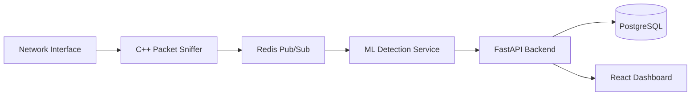

# 🛡️ DeepTrace – Real-Time Network Intrusion Detection System

DeepTrace is a **full-stack, real-time network intrusion detection system (NIDS)** that captures live network traffic, reconstructs TCP flows, extracts statistical features, and classifies traffic as **BENIGN** or **MALICIOUS** using machine learning.

The project mirrors how modern IDS/IPS and SOC observability platforms operate in production environments.

---

## 📖 Project Overview

DeepTrace is built as a set of decoupled, event-driven services working together in a streaming pipeline:

- **DeepTrace Sniffer (C++)**  
  A high-performance packet capture engine that listens to the network interface, reconstructs TCP flows, and computes statistical features such as variance, inter-arrival time, and flow duration in real time.

- **Message Broker (Redis)**  
  Acts as a buffering and decoupling layer between packet capture and ML inference, enabling low-latency message passing.

- **DeepTrace Brain (Python)**  
  Consumes extracted flow features and classifies traffic using a trained **Random Forest** model, predicting BENIGN or MALICIOUS behavior.

- **Backend & Dashboard**  
  Persists alerts to a database and visualizes detected threats through a live dashboard.

---

## 🏗️ High-Level Architecture

1. Network packets are captured by the C++ sniffer from the active interface  
2. TCP flows are reconstructed and enriched with statistical features  
3. Flow data is published to Redis using Pub/Sub  
4. The ML service consumes flow events and performs classification  
5. Alerts are stored in PostgreSQL through a FastAPI backend  
6. A React dashboard polls the backend and displays threats in near real time  

---
## ⚡ Flow Diagram

---

## 🚀 Features

- **Real-Time Packet Capture**  
  Custom C++17 engine built with libpcap for low-latency sniffing.

- **Flow-Based Feature Extraction**  
  Computes advanced metrics including flow duration, packet size variance, and inter-arrival time on the fly.

- **Machine Learning Detection**  
  Random Forest classifier trained on the CIC-IDS2017 dataset to detect modern attack patterns.

- **Live Threat Dashboard**  
  React-based UI that refreshes every two seconds to show detected attacks.

- **Simulation Mode**  
  Built-in mechanism to inject synthetic attack traffic and validate system behavior.

- **Fully Containerized**  
  All components are orchestrated using Docker Compose for easy setup and reproducibility.

---

## 🛠️ Tech Stack

- **Packet Capture & Feature Engineering:** C++17, libpcap, nlohmann-json  
- **Message Broker:** Redis (Pub/Sub)  
- **Machine Learning:** Python, scikit-learn, Pandas  
- **Backend API:** FastAPI, SQLAlchemy  
- **Database:** PostgreSQL  
- **Frontend:** React.js, Vite, Recharts  
- **DevOps:** Docker, Docker Compose  

---

## 🏁 Getting Started

### Prerequisites

- Docker and Docker Compose installed  
- Optional: Python 3.9+ for running services outside containers  

### Setup & Run

- Clone the repository from GitHub  
- Build all services using Docker Compose  
- Start the full system in detached mode  

### Service Endpoints

- **Dashboard:** http://localhost:3000  
- **API Documentation:** http://localhost:8000/docs  
- **Redis:** Port 6379  
- **PostgreSQL:** Port 5432  

---

## 🕹️ Usage

### Monitoring Real Traffic

By default, the C++ sniffer listens on the `eth0` interface inside the container.  
Open the dashboard and generate traffic by browsing the web.

**Note:** Normal traffic is filtered out. Only detected attacks are stored and displayed.

### Simulating an Attack

To test the system without real attacks:

- Open the dashboard  
- Click **Simulate Attack** (top-right)  
- A synthetic DDoS-style flow is injected  
- The alert appears instantly  

---

## 📂 Project Structure

- `data` – datasets and PCAP files  
- `deeptrace-sniffer` – C++ packet capture and flow processing engine  
- `deeptrace-brain` – Python ML inference service  
- `deeptrace-api` – FastAPI backend and database models  
- `deeptrace-dashboard` – React frontend application  
- `docker-compose.yml` – service orchestration  

---

## 🔮 Future Roadmap

- Add UDP and ICMP flow tracking  
- Replace Redis with Apache Kafka for durable streaming  
- Introduce deep learning models for zero-day detection  
- Add Kubernetes manifests for scalable deployment  

---

## 👤 Author - Smit D

💻 [GitHub](https://github.com/smit-0001)

🔗 [LinkedIn](https://www.linkedin.com/in/smit-b-dhandhukia)

---

🧠 **DeepTrace — Turning raw packets into actionable security insights in real time.**
